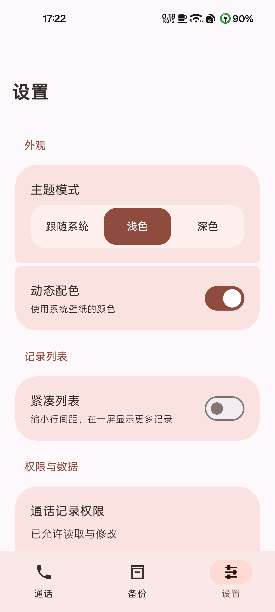
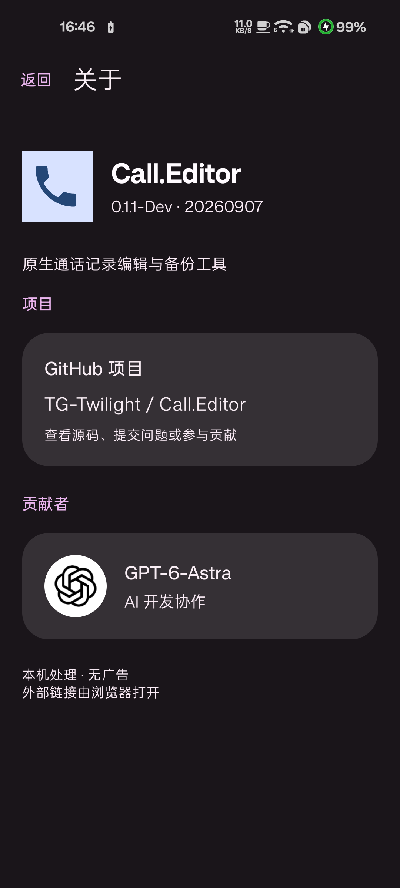

# Call.Editor

**简体中文** · [English](readme/README_en-US.md) · [繁體中文](readme/README_zh-TW.md)

基于 Kotlin、Jetpack Compose 与 Material 3 Expressive 的原生 Android 通话记录编辑与备份工具。

包名：`com.twilight.calleditor` · [下载安装包与查看更新](https://github.com/TG-Twilight/Call.Editor/releases)

## 功能

- 直接查看系统通话记录，按姓名或号码搜索，按通话类型筛选，按日期分组。
- 新增、编辑和删除单条记录；保留未修改字段、原始通话类型和电话账户信息。
- 导出 JSON 备份；恢复前预览，追加导入并跳过完全相同的记录。
- 跟随系统／浅色／深色主题、系统动态配色、紧凑列表；设置重启后保留。
- 独立关于页，提供 GitHub 项目与带头像的贡献者链接。
- 数据在本机处理，无广告 SDK，无应用联网权限。外部链接交由浏览器打开。

**短信编辑与备份仍在规划中，当前版本不提供短信功能，也不接管默认短信应用。**

## 界面

以下截图来自实际应用，仅展示不含私人记录的页面；应用界面目前为简体中文。

 

## 使用与数据

支持 Android 8.0（API 26）及以上；动态配色需要 Android 12 及以上。读取与编辑需授予系统通话记录权限。

保存和删除会修改系统通话记录。JSON 备份为明文，包含号码、显示姓名、时间、时长、类型与电话账户，不包含录音、联系人通讯录、短信或所有厂商扩展字段。恢复采用追加与去重，不清空已有记录。

本版以新包名独立安装，可与早期 `com.android.calleditor` 版本共存。应用私有设置不会自动迁移；系统通话记录无需复制。保留早期原生版本的 JSON 格式标识 `com.android.calleditor.calllog`（version 1），旧原生备份可继续读取；旧 Flutter 私有备份尚不兼容。

## 构建

安装完整 JDK 21、Android SDK Platform 36 与 Build Tools 37.0.0。用 Android Studio 打开 `native/`，或配置 `ANDROID_HOME`／本地 `native/local.properties` 后执行：

```bash
cd native
./gradlew :app:testReleaseUnitTest :app:assembleRelease :app:lintRelease
```

Windows 使用 `gradlew.bat`。首次构建需要联网下载 Gradle 和 Maven 依赖；缓存完整后可加 `--offline`。

产物位于 `native/app/build/outputs/apk/release/`，默认是**未签名 release APK**。正式交付使用维护者固定证书，不使用 Android Debug 证书。维护者的 Windows 签名流程见 [构建说明](native/README.md)；密钥和密码不包含在仓库中。

具体工具链、依赖与 SDK 版本以 `native/` 中的 Gradle 配置为准。项目使用实验性 Material3 Expressive API。

## 目录

```text
native/                 Android 原生源码、测试和 Gradle Wrapper
readme/README_en-US.md   英文说明
readme/README_zh-TW.md   繁体中文说明
readme/screenshots/     可公开的界面截图
readme/ASSETS.md         图片来源说明
```

## 开发状态

当前为 Dev 版本。数据规则有 JVM 单元测试，并在 Android 15 真机验证过通话增改删、备份与去重、导航和设置；不代表已完成所有厂商和系统版本验证。

已知限制：写操作期间发生配置重建或系统强杀，尚缺少完整的操作结果恢复机制；跨设备电话账户映射、更多机型、大字体／横屏、恢复中断和旧备份兼容仍需完善。

版本号使用日期 `YYYYMMDD`，版本名独立维护。当前值在 `native/app/build.gradle.kts` 中固定，构建不会自行改写日期。

## 参与项目

[GitHub 项目](https://github.com/TG-Twilight/Call.Editor) · [提交问题](https://github.com/TG-Twilight/Call.Editor/issues) · [Pull requests](https://github.com/TG-Twilight/Call.Editor/pulls)

提交问题时请附 Android 版本、机型和复现步骤；截图、日志和测试文件请先去除真实号码、联系人及短信内容。

### 贡献者

<a href="https://openai.com/index/gpt-6-astra/"></a>

[GPT-6-Astra](https://openai.com/index/gpt-6-astra/) — AI 开发协作。

## 许可证

本项目采用 [GNU GPL v3](LICENSE) 许可证。第三方依赖和图形标识保留各自的许可与权利，图片来源见 [资源说明](readme/ASSETS.md)。
