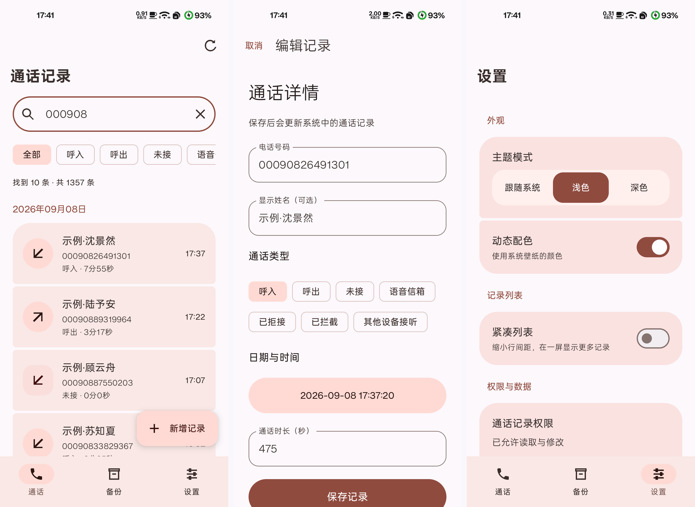

# Call.Editor

[简体中文](../README.md) · **English** · [繁體中文](README_zh-TW.md)

A native Android call log editor and backup tool built with Kotlin, Jetpack Compose, and Material 3 Expressive.

Application ID: `com.twilight.calleditor` · [Downloads and release notes](https://github.com/TG-Twilight/Call.Editor/releases)

## Features

- Browse system call logs, search names or numbers, filter call types, and group by date.
- Add, edit, and delete individual entries while preserving unchanged fields, original types, and phone accounts.
- Export JSON backups; preview imports and append entries while skipping exact duplicates.
- System/light/dark themes, dynamic colors, and compact lists, with persistent preferences.
- An About page with project links and contributor avatars.
- Local data processing, no advertising SDKs, and no app internet permission. External links open in the browser.

**SMS editing and backup are planned, not implemented. This version does not become the default SMS app.**

## Screenshots

Actual app screenshots in light mode, showing the call list, record editor, and settings. The demo contains ten randomly generated fictional names and numbers, with the list filtered to these sample records. No real contacts or numbers are shown. The app interface is currently in Simplified Chinese; this document is an English translation.



## Requirements and data

Android 8.0 (API 26) or later; dynamic colors require Android 12 or later. Grant call log permissions to read and edit records.

Saving or deleting changes the system call log. Backups are plain-text JSON containing numbers, display names, timestamps, durations, types, and phone accounts. They do not include recordings, address books, SMS, or every vendor extension. Restore appends and deduplicates; it does not clear existing entries.

The new package installs separately from earlier `com.android.calleditor` builds. Private preferences do not migrate automatically; system call logs do not need to be copied. The original native JSON format identifier `com.android.calleditor.calllog` (version 1) is retained for backup compatibility. Legacy Flutter private backups are not supported.

## Build

Install a full JDK 21, Android SDK Platform 36, and Build Tools 37.0.0. Open `native/` in Android Studio, or configure `ANDROID_HOME` / `native/local.properties` and run:

```bash
cd native
./gradlew :app:testReleaseUnitTest :app:assembleRelease :app:lintRelease
```

Use `gradlew.bat` on Windows. The first build downloads Gradle and Maven dependencies; add `--offline` when fully cached.

The output in `native/app/build/outputs/apk/release/` is an **unsigned release APK**. Distributed builds use the maintainer's fixed certificate, never an Android Debug certificate. See [build notes](../native/README.md) for the Windows signing workflow. Keys and passwords are not included.

The Gradle configuration in `native/` is the source of truth for toolchain, dependency, and SDK versions. The project uses experimental Material3 Expressive APIs.

## Project structure

- `native/`: Android source, tests, and Gradle Wrapper.
- `readme/`: translated READMEs, shared `screenshots/`, and [asset attribution](ASSETS.md).

## Development status

This is a Dev build. JVM tests cover data rules; Android 15 device checks cover call creation/editing/deletion, backup deduplication, navigation, and preferences. Other devices and OS versions are not comprehensively verified.

Known limitations include incomplete operation-result recovery when configuration changes or process termination occur during writes. Cross-device account mapping, more devices, large fonts/landscape, interrupted restores, and legacy backup compatibility need further work.

Version codes use `YYYYMMDD`; version names are maintained separately. Values are fixed in `native/app/build.gradle.kts`, rather than changing automatically at build time.

## Contribute

[Repository](https://github.com/TG-Twilight/Call.Editor) · [Issues](https://github.com/TG-Twilight/Call.Editor/issues) · [Pull requests](https://github.com/TG-Twilight/Call.Editor/pulls)

Include the Android version, device model, and reproduction steps. Remove real phone numbers, contacts, and message contents from submitted screenshots, logs, and test files.

### Contributors

<a href="https://openai.com/index/gpt-6-astra/"></a>

[GPT-6-Astra](https://openai.com/index/gpt-6-astra/) — AI development collaboration.

## License

This project is licensed under [GNU GPL v3](../LICENSE). Third-party dependencies and graphic marks retain their respective licenses and rights; see [asset attribution](ASSETS.md).
