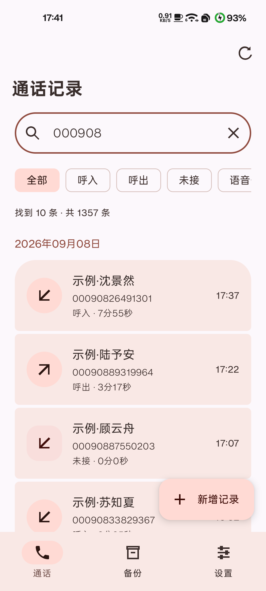
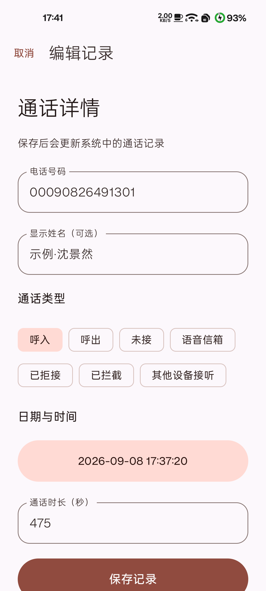

# Call.Editor

[简体中文](../README.md) · [English](README_en-US.md) · **繁體中文**

使用 Kotlin、Jetpack Compose 與 Material 3 Expressive 開發的原生 Android 通話紀錄編輯與備份工具。

套件名稱：`com.twilight.calleditor` · [下載安裝包與查看更新](https://github.com/TG-Twilight/Call.Editor/releases)

## 功能

- 直接瀏覽系統通話紀錄，依姓名或號碼搜尋、依通話類型篩選，並按日期分組。
- 新增、編輯與刪除單筆紀錄，保留未修改欄位、原始通話類型與電話帳戶資訊。
- 匯出 JSON 備份；還原前預覽，以附加方式匯入並略過完全相同的紀錄。
- 跟隨系統／淺色／深色主題、動態配色與緊湊清單；重新啟動後保留設定。
- 獨立關於頁面，提供 GitHub 專案與附頭像的貢獻者連結。
- 資料在本機處理，無廣告 SDK，應用程式不要求網際網路權限。外部連結透過瀏覽器開啟。

**簡訊編輯與備份仍在規劃中，目前版本不提供簡訊功能，也不接管預設簡訊應用程式。**

## 畫面

以下為淺色模式下的實際應用程式截圖，依序為通話紀錄、編輯紀錄與設定頁面。示範資料包含十組隨機產生的虛構姓名與號碼，清單已篩選為範例紀錄；不顯示真實聯絡人或號碼。介面目前使用簡體中文，本文件為繁體中文說明。

  

## 使用與資料

支援 Android 8.0（API 26）以上；動態配色需要 Android 12 以上。讀取與編輯需授予系統通話紀錄權限。

儲存與刪除會修改系統通話紀錄。JSON 備份為明文，包含號碼、顯示姓名、時間、時長、類型與電話帳戶，不包含錄音、通訊錄、簡訊或所有廠商擴充欄位。還原採附加與去重方式，不清空既有紀錄。

本版以新套件名稱獨立安裝，可與早期 `com.android.calleditor` 版本並存。應用程式私人設定不會自動移轉；系統通話紀錄無須複製。保留早期原生版本的 JSON 格式識別碼 `com.android.calleditor.calllog`（version 1），可繼續讀取舊原生備份；舊 Flutter 私有備份尚不相容。

## 建置

安裝完整 JDK 21、Android SDK Platform 36 與 Build Tools 37.0.0。使用 Android Studio 開啟 `native/`，或設定 `ANDROID_HOME`／本機 `native/local.properties` 後執行：

```bash
cd native
./gradlew :app:testReleaseUnitTest :app:assembleRelease :app:lintRelease
```

Windows 使用 `gradlew.bat`。首次建置需連線下載 Gradle 與 Maven 相依套件；快取完整後可加上 `--offline`。

產物位於 `native/app/build/outputs/apk/release/`，預設為**未簽署的 release APK**。正式交付使用維護者固定憑證，不使用 Android Debug 憑證。維護者的 Windows 簽署流程見[建置說明](../native/README.md)；儲存庫不包含金鑰與密碼。

工具鏈、相依套件與 SDK 版本以 `native/` 中的 Gradle 設定為準。專案使用實驗性 Material3 Expressive API。

## 目錄

- `native/`：Android 原生程式碼、測試與 Gradle Wrapper。
- `readme/`：多語言 README、共用 `screenshots/` 與[圖片來源說明](ASSETS.md)。

## 開發狀態

目前為 Dev 版本。資料規則有 JVM 單元測試，並曾在 Android 15 實機驗證通話增改刪、備份去重、導覽與設定；不代表已完成所有廠商及系統版本驗證。

已知限制：寫入期間若發生設定重建或程序終止，尚缺少完整的操作結果復原機制。跨裝置電話帳戶對應、更多機型、大字體／橫向畫面、還原中斷與舊備份相容性仍需完善。

版本代碼使用日期 `YYYYMMDD`，版本名稱獨立維護。目前數值固定於 `native/app/build.gradle.kts`，建置不會自動改寫日期。

## 參與專案

[GitHub 專案](https://github.com/TG-Twilight/Call.Editor) · [回報問題](https://github.com/TG-Twilight/Call.Editor/issues) · [Pull requests](https://github.com/TG-Twilight/Call.Editor/pulls)

回報時請附 Android 版本、機型與重現步驟；提交前請移除截圖、記錄檔與測試檔案中的真實號碼、聯絡人和簡訊內容。

### 貢獻者

<a href="https://openai.com/index/gpt-6-astra/"></a>

[GPT-6-Astra](https://openai.com/index/gpt-6-astra/) — AI 開發協作。

## 授權條款

本專案採用 [GNU GPL v3](../LICENSE) 授權條款。第三方相依套件與圖形標識保留各自的授權與權利，圖片來源見[資源說明](ASSETS.md)。
